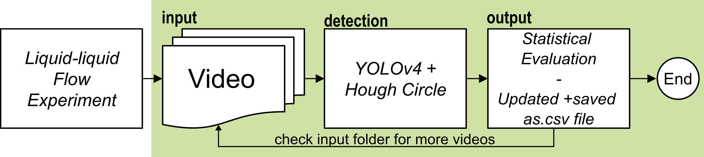

# DropletDetection-YOLOv4

This repository contains the code for the AI-based droplet detection by Inga Burke, Thajeevan Dhayaparan, Ahmed S. Youssef, Katharina Schmidt, and Norbert Kockmann, TU Dortmund University published here: ADD DOI PAPER.
The code can be used to detect droplets automatically based on captured videos with the help of YOLOv4 and Hough Circle. 

### Needed modules (list may not be complete!):

See requirement.txt to create a conda virtual environment.

### yolov4.py (main program)

Open this file to execute the whole workflow as shown below:

The therminal command is given as Command_Terminal.txt file or can be found here:

python yolov4.py -input_path input -output output -confidence 0.6

 <ul>
  <li>input = folder path to input video</li>
  <li>output = folder for detection images and statistical evaluation [if not existing it will be created]</li>
  <li>CS = confidence score; example: 0.6 means 60% confidence</li>
</ul> 

Further inputs are possible; please check the main skript for those. Additionally your pixel-to-micrometer ratio needs to be adapted in the yolov4.py as well as the input image size.
Here it's importatnt that the input image size is a multiple of 32.
All information used for this work and program base on [1] and [2]. For further information those references are recoomended.

### Example Video  

An example video to test the program is given in the input folder. An output folder is already created, where the statistical evaluation as well as the images including the detection are saved.
Actually one frame per second is extracted of the video. If a higher number is necessary, an adaption of the code is necessary.

### References
[1] Bochkovskiy A, Wang C-Y, Liao H-YM (2020) YOLOv4: Optimal Speed and Accuracy of Object Detection. https://doi.org/10.48550/arXiv.2004.10934  
[2] Bochkovskiy A (2021) GitHub - AlexeyAB/ darknet. In: GitHub. https://github.com/AlexeyAB/darknet/tree/master. Accessed 12 Mar 2024
